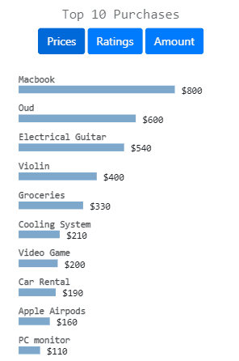
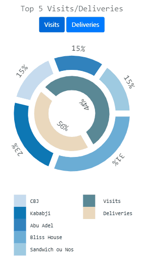
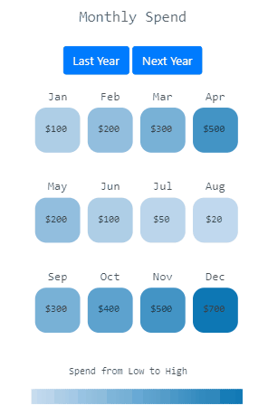

# Mobile App Analytics with d3.js

The aim of this project was to use d3.js to build three graphs that provide some insightful analytics
to mobile applications. These graphs include a histogram, a pie chart and calendar heatmap. Examples of these 
three graphs can be seen below:

#### This first graph is a histogram that takes various top 10 items and sorts them by different categories/KPIs

#### The Second graph is a pie chart that studies, for instances the Top 5 Visits Vs Deliveries for Restaurants

#### The Third graph is a heatmap that studies monthly spend. It also shows the highest and lowest amount spent for a specific month.

Copyright @Decentra Tech, Beirut Lebanon

Code can't be shown for copyright reasons
